# tuffgit21

> Memorable developer positioning.

## Header

  

  

Hi, I'm **tuffgit21**. This README shares what I'm building, the tools I use, and the work I'm proud of.

  <picture>
    <source media="(prefers-color-scheme: light)" srcset="https://www.gitskins.com/api/section/hero?username=tuffgit21&theme=github-dark&style=terminal&mode=light" />
    
  </picture>

## About Me

  <picture>
    <source media="(prefers-color-scheme: light)" srcset="https://www.gitskins.com/api/section/about?username=tuffgit21&theme=github-dark&style=terminal&mode=light" />
    
  </picture>

## Skills

  <picture>
    <source media="(prefers-color-scheme: light)" srcset="https://www.gitskins.com/api/section/stack?username=tuffgit21&theme=github-dark&style=terminal&mode=light" />
    
  </picture>

## GitHub Stats

  <picture>
    <source media="(prefers-color-scheme: light)" srcset="https://www.gitskins.com/api/section/stats?username=tuffgit21&theme=github-dark&style=terminal&mode=light" />
    
  </picture>

## Projects

  <picture>
    <source media="(prefers-color-scheme: light)" srcset="https://www.gitskins.com/api/section/projects?username=tuffgit21&theme=github-dark&style=terminal&mode=light" />
    
  </picture>

## Connect

  <picture>
    <source media="(prefers-color-scheme: light)" srcset="https://www.gitskins.com/api/section/social?username=tuffgit21&theme=github-dark&style=terminal&mode=light" />
    
  </picture>

